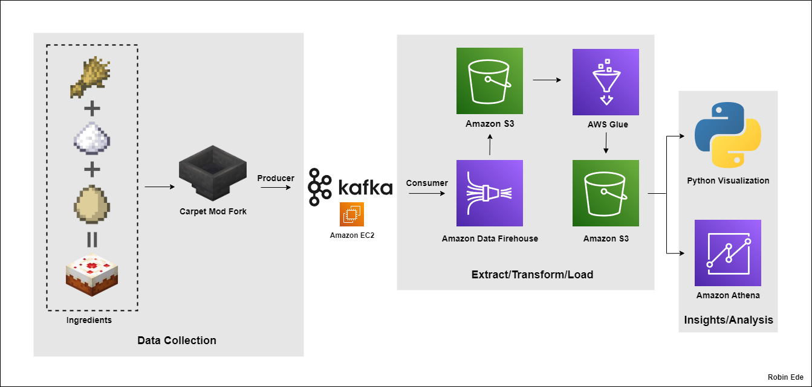

# Minecraft Cake Production Optimization Using Kafka and AWS

This project aims to optimize cake production in a Minecraft automatic cake crafting farm in the latest version, 1.21.1, inspired by [TurtleNation's Automatic Cake Farm](https://youtu.be/_39jmQRSUrw?si=QiAl9zy82fbdzQ81) build. The project leverages data streaming via Kafka and AWS services to analyze item production and consumption events. By analyzing this data, we modify the farm's configuration to improve its efficiency.

## Architecture Diagram


## Project Goals

- **Primary Objective**: To optimize the efficiency of cake production by monitoring and analyzing the farm's item stream data.
- **Data Engineering Focus**: Streaming Minecraft item event data using Kafka, processing it through AWS services, and querying the results to identify bottlenecks or inefficiencies.
- **Output**: Modify the farm design based on real-time data insights to improve production rates.

## Technologies Used

- **Kafka**: For streaming item events from the Minecraft plugin to consumers.
- **AWS Kinesis Firehose**: To ingest streamed data from Kafka consumers into AWS for storage.
- **Amazon S3**: For storing raw and processed data.
- **AWS Glue**: For transforming raw data into a more structured format (Parquet) for analysis.
- **Amazon Athena**: For querying the processed data stored in S3.
- **Minecraft**: The game platform where the automatic cake production farm operates.
- **Carpet Mod**: A popular Fabric mod for Minecraft, which I've forked and extended for this project.

## Carpet Mod Fork

For this project, I've created a custom fork of the [Carpet mod](https://github.com/gnembon/fabric-carpet/). Carpet is a powerful Fabric mod that provides a wide range of features for technical Minecraft players, server operators, and developers. My fork extends Carpet's functionality to include:

1. **Item Tracking**: Precise monitoring of item production and consumption within the cake farm.
2. **Kafka Integration**: Built-in capability to send item event data directly to a Kafka topic.


The forked Carpet mod acts as the Kafka producer in my architecture, streaming real-time data about the cake farm's operations.

## How It Works

1. **Data Generation**:
   - The **forked Carpet mod** (Kafka Producer) is integrated into the Minecraft client.
   - The mod tracks item event data (e.g., wheat, sugar, egg production rates) and sends the data to a **Kafka Topic**.

2. **Data Streaming**:
   - A **Kafka Consumer** (running on EC2 or locally) reads the data from the Kafka Topic and pushes it to **AWS Kinesis Firehose**.

3. **Raw Data Storage**:
   - The data ingested by Kinesis Firehose is stored in **Amazon S3** as raw JSON files.

4. **Data Transformation**:
   - **AWS Glue** processes the raw data, transforming it into **Parquet format** for optimized querying.

5. **Data Querying**:
   - **Amazon Athena** is used to run SQL queries on the processed data to analyze cake production efficiency, item throughput, and potential bottlenecks.

6. **Visualization (Optional)**:
   - The processed data can be visualized through matplotlib and seaborn, providing insights into production trends and optimization strategies.

## How to Set Up

### Prerequisites

- Minecraft client with Fabric installed.
- AWS account with access to S3, Glue, Kinesis, and Athena.
- Kafka setup on EC2 or locally, with a running Kafka broker and Zookeeper.

### Steps

1. **Deploy Forked Carpet Mod**:
   - Clone my [forked version of Carpet mod](https://github.com/robin-ede/kafka-carpet-fork).
   - Follow the installation instructions in the repository to add the mod to your Fabric-enabled Minecraft client.
   - Configure the mod to produce messages to your Kafka Topic.

2. **Set Up Kafka**:
   - Ensure Kafka is running on EC2 or locally.
   - Create a topic for Minecraft item event streams.
   - Configure a consumer to read from the topic and push data to AWS Kinesis Firehose.

3. **Configure AWS Kinesis Firehose**:
   - Set up a Kinesis Firehose delivery stream that sends data to an S3 bucket.

4. **Create AWS Glue Job**:
   - Set up an AWS Glue job to transform raw data from S3 into Parquet format and store it in a processed data bucket.

5. **Query with Athena**:
   - Use Athena to query the transformed data stored in S3 and analyze the results.

6. **Visualize Data**:
   - Use transformed data to create visuals using matplotlib and seaborn.

## Project Structure

The repository contains the following key scripts:

- **Kafka to Kinesis Firehose Consumer** ([`firehose_consumer.py`](scripts/firehose_consumer.py)): 
   - Receives Minecraft item data (item type, amount, tick) from Kafka in string format.
   - Sends the data to AWS Kinesis Firehose in JSON format using the Boto3 SDK.
   - Ensure that AWS CLI is authenticated for Boto3 to work properly.
   - Replace `YOUR_FIREHOSE_STREAM_NAME`, `YOUR_KAFKA_IP`, `YOUR_TOPIC` with your values.

- **PySpark ETL Script** ([`pyspark_etl.py`](scripts/pyspark_etl.py)):
   - Converts game ticks into timestamps and processes raw data from S3.
   - Converts data to Parquet format for optimized querying and stores it in S3.
   - This script is used as part of an AWS Glue job.
   - Replace `YOUR_BUCKET_NAME` with your values.

- **Athena Queries** ([`athena_queries.sql`](scripts/athena_queries.sql)):
   - Contains SQL queries for analyzing the processed data in Athena.
   - Queries include tracking production rates and identifying inefficiencies in the farm.

## Data Analysis: Production Rates and Optimizations

### 1. Old Ingredient Production Rates (Items per Hour)

In the original setup, the production rates for the key ingredients were as follows:

```
Production Rates (Old Ingredients) - Items per Hour:
ItemName
minecraft:egg      1030.46
minecraft:sugar    1823.13
minecraft:wheat    2340.86
```

#### Identifying the Limiting Factors

Since the cake recipe requires different amounts of each ingredient, we need to calculate how much wheat and sugar are needed relative to eggs.

- For every 1 egg, you need:
  - **3 units of wheat**
  - **2 units of sugar**

Therefore, the effective production rates for wheat and sugar must be compared in terms of how much is required per egg to make cakes.

### 2. Math for the Limiting Factors

#### Wheat Requirement Calculation:

We need **3 units of wheat** for every 1 egg. Given that the egg production rate is **1030.46 eggs per hour**, the required wheat production rate should be:

```
Required Wheat Production Rate = 3 * Egg Production Rate
Required Wheat Production Rate = 3 * 1030.46 = 3091.38 wheat per hour
```

The actual wheat production rate is **2340.86 wheat per hour**, which means wheat production needs to increase:

```
Percentage Increase in Wheat = ((3091.38 - 2340.86) / 2340.86) * 100 = 32.06%
```

So, wheat production needs to be increased by **32.06%** to match the egg production rate and ensure there is enough wheat for cake crafting.

#### Sugar Requirement Calculation:

We need **2 units of sugar** for every 1 egg. The required sugar production rate is:

```
Required Sugar Production Rate = 2 * Egg Production Rate
Required Sugar Production Rate = 2 * 1030.46 = 2060.92 sugar per hour
```

The actual sugar production rate is **1823.13 sugar per hour**, which means sugar production needs to increase:

```
Percentage Increase in Sugar = ((2060.92 - 1823.13) / 1823.13) * 100 = 13.04%
```

Thus, sugar production needs to be increased by **13.06%** to match the egg production rate and ensure there is enough sugar for cake crafting.

### 3. Final Production Rates After Optimization

After adjusting the sugar and wheat production, the new ingredient production rates became:

```
Production Rates (New Ingredients) - Items per Hour:
ItemName
minecraft:egg      1036.78
minecraft:sugar    2065.04
minecraft:wheat    3061.81
```

The production rates now align more closely with the requirements for making cakes at the optimal rate. Both sugar and wheat production were increased by **13.04%** and **30.8%**, respectively, to ensure that they no longer limit the cake production.

### 4. Old vs New Cake Production

Before the optimizations, the cake production rate was limited by sugar and wheat production. After optimizing the ingredient production rates, I achieved the following results for cake production:

- **Old Cake Production Rate**: 830.38 cakes per hour
- **New Cake Production Rate**: 990.02 cakes per hour

This represents a **19.2% improvement** in the overall cake production rate, indicating that the optimizations in sugar and wheat production significantly increased the rate of cake crafting.

### 5. Visualizations

#### a. Ingredient Production Pie Chart (Before vs After):

- This pie chart shows the percentage contribution of each ingredient (wheat, sugar, egg) before and after the optimizations.
- It visually demonstrates how the production of wheat and sugar were the limiting factors in the old setup and how their proportions were adjusted after optimization.

#### b. Cumulative Ingredient Production Line Chart (Before vs After):

- This line chart compares the cumulative production of wheat, sugar, and eggs over time in both the old and new setups.
- It clearly illustrates the increased rates of wheat and sugar production over time, matching the requirements for cake crafting.

#### c. Cumulative Cake Production Line Chart (Old vs New):

- This chart tracks the cumulative number of cakes crafted over time.
- It highlights the significant improvement in cake production after the optimization, with the new setup producing cakes at a much faster rate compared to the old one.

## Future Work

1. **Improved Item Tracking in Carpet Mod Fork**:
   - Implement a non-destructive item tracking system that doesn't rely on items being deleted after counting.
   - Enable simultaneous tracking of ingredients and finished cakes without interference.

2. **Expanded Farm Compatibility**:
   - Create a configuration system to make the mod adaptable to various farm layouts and designs.
   - Add support for tracking items in different transport systems (e.g., water streams, dropper lines).

3. **Performance Optimization**:
   - Conduct performance testing to ensure minimal impact on server performance.
   - Optimize data transmission to Kafka to reduce network overhead.

4. **User Interface Improvements**:
   - Develop a simple in-game interface to display real-time production statistics.
   - Create a basic web dashboard for visualizing farm performance metrics.

5. **Extended Minecraft Integration**:
   - Implement basic tracking of in-game events (e.g., weather changes) that might affect farm efficiency.
   - Explore compatibility with other popular technical Minecraft mods.

These improvements aim to create a more flexible and powerful tool for analyzing and optimizing Minecraft automation systems, starting with cake production but potentially extending to other technical Minecraft projects.